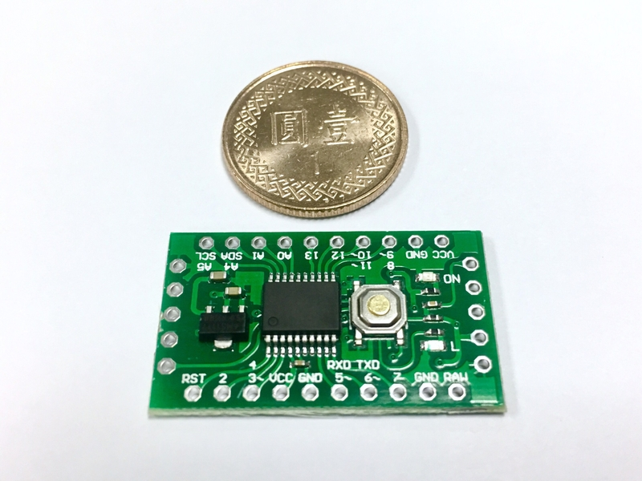
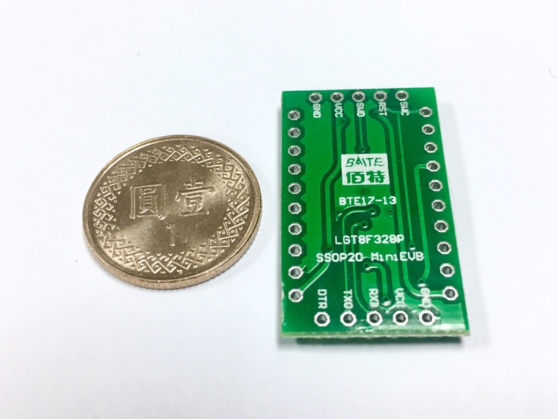
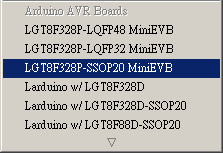
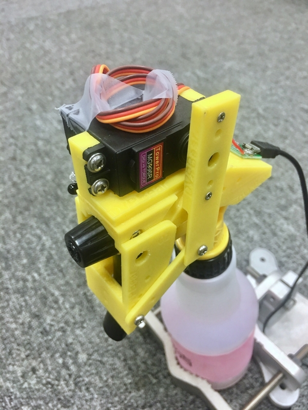
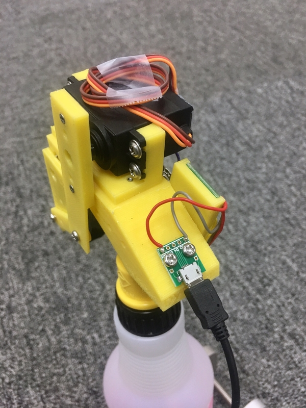
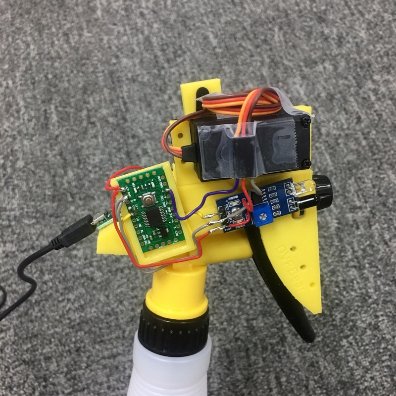
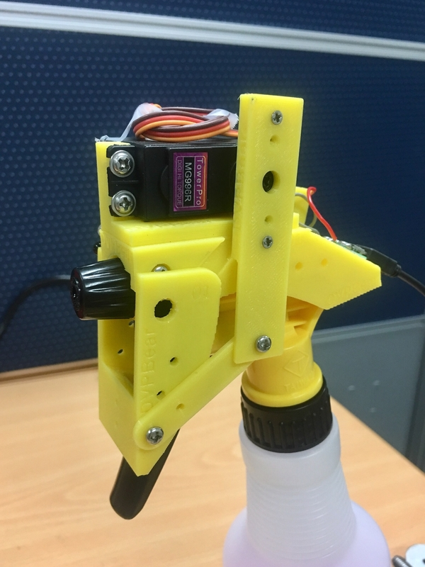
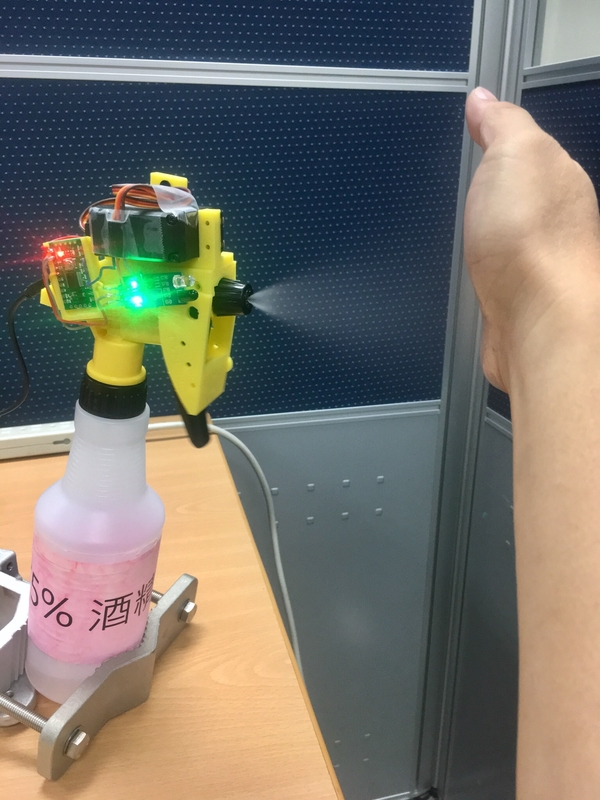
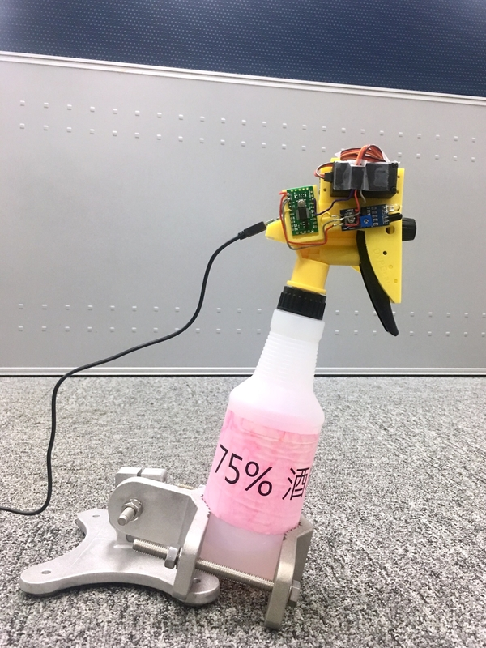

# 自動酒精噴霧瓶

use LogicGreen LGT8F328P Microcontroller (AVR Mega328 compatible)

## 前言

疫情的關係，辦公室的茶水區放了一個普通的酒精噴瓶。前陣子在網路上看到許多高手紛紛製作了不同樣式的自動噴霧瓶。剛好之前好奇買了左岸便宜的開發板，所以乾脆就拿它來仿製一個。

我找了一些影片和資料，最後找了一個我比較喜歡的版本來仿製。說明網頁在這：

* [[小熊的開發日誌] 噴頭01 紅外線自動酒精噴霧器](https://blog.xuite.net/m0923678421/development/589011382)

我比較喜歡這個版本是因為它使用的是市面上的標準噴頭，沒有另外設計不同的容器或是不同的噴灑方式。所以我可以去 10 元店單獨買噴頭，然後把他設計的機構裝上去，最後換掉原來的舊噴頭就好。萬一之後不想用了，也能方便換回原本的噴頭。

另外，作者（小熊）也調查了市面上常見的幾款噴頭，總共製作出三種機構，分別適用於三種常見的噴頭。而且機構也採模組化設計，就算換噴頭也只有少數幾個元件需要重新列印。大家可以關注他的頻道：

* 小熊的 Youtube 頻道 -- [熊的開發 DVPBear](https://www.youtube.com/channel/UCx74OaAnnBDV6ml8Mc01qKQ)

## 製作方法

大致上你要做的事情有：

1. 選定噴頭。先去看小熊的網誌或是 Youtube 頻道，記下三種不同的噴頭樣式，然後看看你可以買到哪一種。
2. 取得噴頭的 3D 列印元件和相應螺絲組。
3. 根據影片說明組裝噴頭機構。
4. 燒錄程式。程式我自己改寫了，後面說明。（當然你也可以使用小熊的版本，行為和效果一樣）
5. 測試 & 修改程式。

## 準備材料

### 3D 列印檔

你可以在小熊的網誌中找到他公開的 3D 列印檔（from [thingiverse](https://www.thingiverse.com/thing:4245845)）自己列印，然後去買齊說明中所提到的螺絲，接著看他 Youtube 裡面的教學一步步製作。三種噴頭都有對應的製作影片，蠻詳細的。

* 說明影片：[[抗疫] 噴頭01 紅外線自動酒精噴霧器 Arduino 酒精 異丙醇](https://www.youtube.com/watch?v=PxWWpVySzto)

我自己使用的是小熊命名為 "噴頭01" 的檔案。

### 螺絲組

* M3 帶墊圓頭自攻尖嘴螺絲
	* 10mm x4 Servo
* M3 圓頭自攻平嘴螺絲
  * 4mm  x3 usb 電源板 + 連桿相連
  * 5mm  x1 開發板座
  * 6mm  x3 板機連桿 + 底座
  * 8mm  x1 02頭
  * 10mm x1 紅外測距 (01頭 +1)
* M2 皿頭自攻尖嘴螺絲
  * 6mm x2 servo 連桿

ps: 機構原作者有公開 .stl 檔案，組裝說明也會提到需要怎樣規格的螺絲。如果嫌麻煩，他在露天賣場也有販售材料包。

## 微處理器

原始的設計使用的是 Arduino Mini。機構上也設計了一個零件用來卡住 Arduino Mini（不過我印出來的零件有點太緊）。之前在左岸看到一個很便宜的 Arduino 相容板，好奇買來試試看。所以軟體的部分，我只有換開發板和重寫程式而已（就是這個 repo 主要放的東西）。

Larduino_HSP_v3.6c/ 內的是原廠提供的 libraries 和 Arduino hardware 支援設定檔。根據 MiniEVB 的說明文件設定好 IDE 對此開發板的支援，即可在 Arduino IDE 環境下開發 MiniEVB

## 程式碼

sketchbook/ 資料夾內的是程式碼。`Auto_Sprayer_v2` 是我的最終運作版本。其餘的都是為了測試而寫的。

Auto_Sprayer_v2.ino 的程式中，有一些行為：

* 如果手一直停在感測器前，還是只會噴灑酒精一次。必須離開遠一點再次靠近才會噴第二次。
* 為了避免有人只是經過，卻因被偵測到就觸發噴灑動作，所以程式中做了判斷，至少需要偵測維持一段時間才判定需要噴灑。程式碼中的決定變數是 keep_detecting_ms，目前設定 800ms。
* 將噴灑的行為包裝成函式 pulling_trigger() 傳入兩個參數，分別是 Servo 角度以及板機按下後停留多久復位。

## 完成品

詳細的機構組裝步驟我就不提了，小熊 Youtube 頻道中的影片已經解釋得很詳細了。

使用 Micro USB 供電。

因為之後還是有可能會把它拆掉（如果都沒有什麼人使用的話 XD），所以主板上盡可能透過共用焊點減少焊接動作。Servo 的線我也沒有剪斷焊接 XD

## 小心得

### 使用金屬齒輪版本的 Servo

其實一開始做的時候我就買錯東西。我買了 MG996R 的 Servo，號稱有 13KG 的扭力（但其實還是推得很吃力）。

一開始裝好、程式燒錄好、執行觸發噴灑幾下後，Servo 突然沒力了。打開 Servo 後發現裡面是塑膠齒輪的，所以跑幾次就滑牙了。後來看到有人單獨賣金屬齒輪，就買來替換。因此拖了一陣子才把它完成。

但我發現既使換了金屬齒輪，Servo 的下壓力量還是沒辦法像手壓一樣有較大的角度。有想過下圖 Servo 帶動的那個垂直連桿，如果再長一點點，會不會連動板機的力矩效應會更好一些？

也曾嘗試想把板機的彈簧取出，想把它弄鬆一點讓 Servo 能增加按壓角度，但這不是很容易而且可能造成板機按壓後無法復位。

### 調整噴口鬆緊

噴頭的噴口可以決定酒精噴灑出來的樣子 -- 霧狀還是水柱狀。當噴灑出來的酒精越接近霧狀的時候，就需要更大的力量按壓板機，否則力量太小會像是滴水的樣子。所以其實最簡易的調整方式就是調整噴口到一個中間值，讓液體噴出時能呈現一些霧狀，同時 Servo 也有足夠的推力。

### 傾斜角度

我把自動噴頭機構旋上瓶身後，發現如果酒精的量不足的話，因為機構的重量會讓噴頭往前傾倒 XD

另外，原始的噴瓶平放在桌面時，噴口方向是微微朝上的。但如果是要感應手靠近，然後自動噴灑的話，噴口其實微微朝下比較順手。

在公司廢料區找到一個老設備的夾具，它有機構可以讓瓶子微微前傾，又有一定的重量可以讓瓶子不傾倒，在還沒有設計新的機構前，先拿來用吧。

~ END ~
